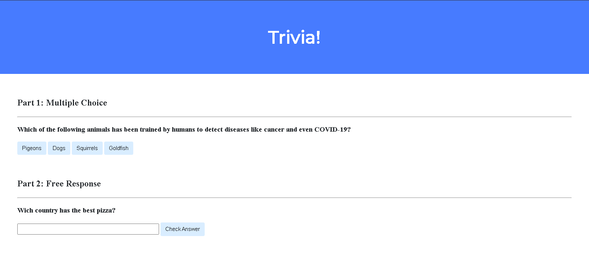

# My CS50 Curriculum – My Learning Process

This curriculum documents my progression through Harvard’s CS50 course, showcasing projects that demonstrate computer science skills.
Each module represents a milestone in my learning, from basic problem solving to application development.

## 🟢 Module 1 – Programming Foundations
**Objective:** Learn basic programming logic, syntax, and problem solving.

| Project | Description | Skills Learned | Demo |
|---------|-------------|----------------|------|
| **Mario** | Generates a pyramid of hashes based on user input. | Loops, conditionals, user input, problem decomposition. | |
| **Cash** | Calculates minimum coins needed for change. | Greedy algorithms, floating-point precision handling. |   |
| **Scrabble** | Compares two words to determine the winner based on Scrabble letter scores. | Arrays, ASCII manipulation, string handling, loops, conditionals. |  |
| **Readability** | Calculates the reading grade level of a given text using the Coleman-Liau index. | String parsing, loops, ASCII checks, mathematical formulas, multiple functions. |  |

---

## 🟡 Module 2 – Data Structures & Algorithms
**Objective:** Understand how data is stored, searched, and manipulated efficiently.

| Project | Description | Skills Learned | Demo |
|---------|-------------|----------------|------|
| **Sort** | Analyzes three compiled programs to determine which sorting algorithm they implement (selection, bubble, or merge sort) and explains reasoning. | Algorithm analysis, time complexity, sorting methods, experimentation with input data. | N/A |
| **Plurality**  | Implements a plurality voting system to tally votes and declare winner(s) in an election.     | Structs, arrays, string comparison, loops, conditionals. |  |
| **Runoff**        | Simulates a ranked choice (instant runoff) election system where voters rank candidates and last place candidates are eliminated until a winner emerges. | Multi-dimensional arrays, structs, boolean logic, loops, election algorithms. |  |
| **Volume**   | Modifies the volume of a .wav audio file by scaling each audio sample by a user specified factor. | File I/O, binary data processing, audio sampling, buffer manipulation. |  |
| **Speller** | Checks text for misspellings using a dictionary. | Hash tables, tries, file I/O, complexity analysis. |  |
| **Filter** | Applies visual filters to images. | Image processing, nested loops, multidimensional arrays. | [Filter](https://github.com/ZeloYello/CS50ProjectLearning/blob/main/cs50-filters.md) |
| **Recover** | Program to recover JPEG images from a raw memory card file by scanning for JPEG signatures and extracting files. | File I/O, byte level data processing, buffer manipulation, working with binary files in C. | N/A |
| **Inheritance** | Simulates genetic inheritance of blood types across multiple generations using structs and pointers in C. Creates family tree and assigns alleles randomly based on parents. | Recursion, structs, pointers, dynamic memory allocation, randomness in C. |  |
| **DNA** | Program that analyzes a DNA sequence to identify a person by matching STR counts against a DNA database using Python. | File I/O, string processing, pattern matching, CSV handling in Python. |  |

---

## 🔵 Module 3 – Web Development Basics
**Objective:** Learn the fundamentals of creating dynamic web applications.

| Project | Description | Skills Learned | Demo |
|---------|-------------|----------------|------|
| **CS50 Finance** | Stock trading simulator with real-time data. | Flask, HTML/CSS, Jinja, SQL, API integration, authentication. |  |
| **Birthdays** | Simple app to store and display birthdays. | Flask, SQLite, CRUD operations. |  |
| **Trivia Webpage** | A simple interactive trivia webpage with multiple choice and free response questions. Users get immediate visual feedback on answers via JavaScript that changes button/input colors and displays correctness messages. | HTML, CSS, JavaScript, DOM manipulation, event handling, user interaction design |  |
| **Homepage** | A multi-page personal website with an about me page, hobby section, and navigation bar using Bootstrap. Features dynamic JavaScript interaction to show random facts and styled image cards. Fully responsive with custom CSS styling and Bootstrap integration. | HTML, CSS, JavaScript, Bootstrap, Responsive Design, DOM Manipulation, Event Handling | No demo available |

---

## 🟣 Module 4 – Databases & Backend Systems
**Objective:** Work with persistent storage and secure backend logic.

| Project | Description | Skills Learned | Demo |
|---------|-------------|----------------|------|
| **Password Manager** *(if applicable)* | Securely stores and retrieves user credentials. | Hashing, authentication, SQL, encryption. |  |
| **Songs** | SQL queries on a Spotify dataset to analyze top streamed songs of 2018, exploring song attributes, ordering, filtering, and aggregation. | SQL querying, database exploration, data filtering, aggregation functions, pattern matching. | N/A |
| **Movies** | SQL queries on an IMDb database to analyze movies, actors, directors, release years, and ratings. Covers filtering, aggregation, and joins in SQL. | SQL querying, database exploration, aggregation functions, joins, filtering, sorting. | N/A |
| **Fiftyville** | Solve the mystery of the stolen CS50 Duck using a SQLite database with town records. Identify the thief, the city they escaped to, and their accomplice by querying the database. | SQL querying, complex SELECT statements, database investigation, debugging, logical reasoning. | N/A |

---

## 🔴 Module 5 – Capstone & Real-World Applications
**Objective:** Apply all skills to build complete, real-world software.

| Project | Description | Skills Learned | Demo |
|---------|-------------|----------------|------|
| **Community Infrastructure Reporter** | Web platform for reporting infrastructure issues, with map integration and image upload. | Flask, Leaflet.js, file uploads, user authentication, admin dashboard, CRUD. |  |

---

## 📈 Suggested Learning Path
1. **Module 1:** Focus on problem-solving and syntax.
2. **Module 2:** Explore data structures for efficiency.
3. **Module 3:** Build dynamic web pages with backend logic.
4. **Module 4:** Learn secure, scalable database interactions.
5. **Module 5:** Create a fully functional product from scratch.

---

### 🎯 About This Curriculum
This repository serves as both a **portfolio** and a **learning roadmap**, demonstrating the progression of skills gained throughout CS50 and related projects.

---
