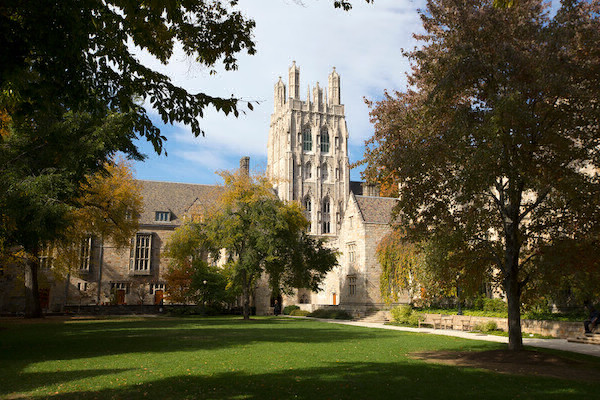

# CS50 Filters Project

## Problem Overview
Implement a program that applies filters (blur, grayscale, reflect, sepia) to BMP images.

You can apply only one filter at a time using command line flags:
- `-b` for blur
- `-g` for grayscale
- `-r` for reflect
- `-s` for sepia

## Heres the Demo on how i run these commands and how the program hadles errors
  

## Examples

| Filter     | Input Image                                   | Output Image                                  |
|------------|----------------------------------------------|----------------------------------------------|
| Grayscale  |  |  |
| Sepia      |           |          |
| Blur       |              |             |
| Reflect    |        |       |
